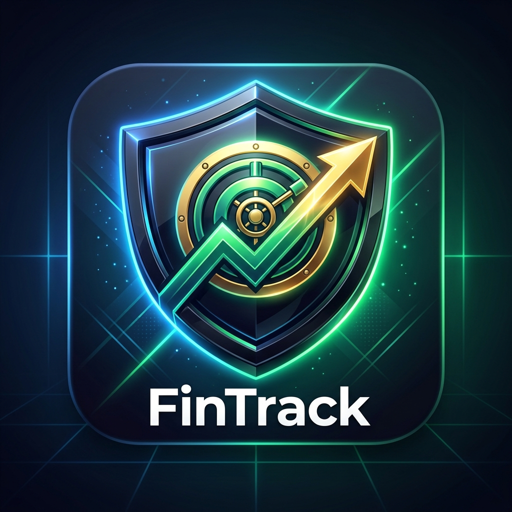

# FinTrack

A privacy-first, local-only personal finance vault built with React, TypeScript, and Dexie.js.

FinTrack keeps your receipts, payslips, and expense history completely offline in your browser's IndexedDB. No backend servers, no tracking APIs, no external data sharing.

<p align="center">
  
</p>

## Highlights

- **Client-Side Receipt Parsing**: Uses in-browser OCR (`tesseract.js` + `pdfjs-dist`) to extract totals, tax, date, and merchant info inside Web Workers.
- **Installable PWA**: Runs as a standalone desktop app (Windows, macOS, Linux) or mobile app with full offline capabilities.
- **Local IndexedDB Storage**: Uses Dexie.js for encrypted, fast client-side storage with optional PIN-lock protection.
- **Payslip & Tax Estimator**: Track monthly net savings, salary structures, and estimated tax brackets locally.

## Getting Started

### Prerequisites

- Node.js 18+
- npm (or pnpm / yarn)

### Quickstart

```bash
# Clone the repository
git clone https://github.com/YOUR_USERNAME/FinTrack.git
cd FinTrack/FinTrack

# Install dependencies
npm install

# Start the dev server
npm run dev
```

Open `http://localhost:5173` in your browser.

### Build & Production Preview

```bash
# Typecheck & build bundle
npm run build

# Preview production build locally
npm run preview
```

## Tech Stack

- **Frontend Framework**: React 18 + TypeScript + Vite
- **Styling**: Tailwind CSS + Lucide Icons
- **Local Database**: Dexie.js (IndexedDB wrapper)
- **OCR Engine**: Tesseract.js & PDF.js
- **PWA**: Service Worker caching + Web App Manifest (`standalone`)

## Privacy Model & Architecture

FinTrack operates under a strict zero-server privacy architecture:

1. **OCR Processing**: Images and PDFs dropped into the scanner are parsed locally inside browser Web Workers. Zero file buffers are uploaded to cloud servers.
2. **Data Control**: Your financial records live exclusively in browser storage. You can export your data as JSON/CSV or wipe your vault at any time.

## Contributing

Contributions are welcome! If you'd like to fix a bug or add a new feature:

1. Fork the project
2. Create your feature branch (`git checkout -b feature/new-feature`)
3. Commit your changes (`git commit -m 'Add new feature'`)
4. Push to the branch (`git push origin feature/new-feature`)
5. Open a Pull Request

## License

This project is open source under the [MIT License](LICENSE).
